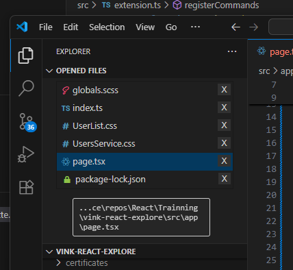
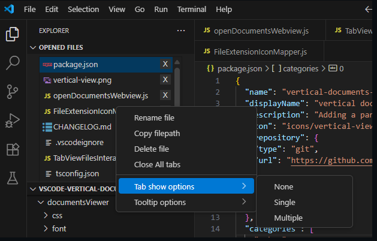
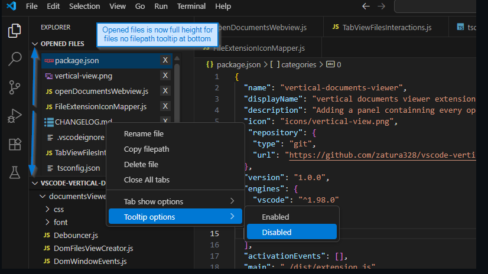

# Vertical document viewer README

It's a vertical file viewer for opened tabs. 
Include some options to show tabs at top or hide them.

## Features
There is a menu for show tabs options:    

Another one if you want more place for file in your window you can disable the tooltip at the bottom:

## Requirements

None

## Extension Settings

## Known Issues

For the moment the extension work only with single editor - multiple editor will come in the next version.

## For more information
[vscode-vertical-document-viewer github](https://github.com/zatura328/vscode-vertical-document-viewer-public)

**Enjoy!**
